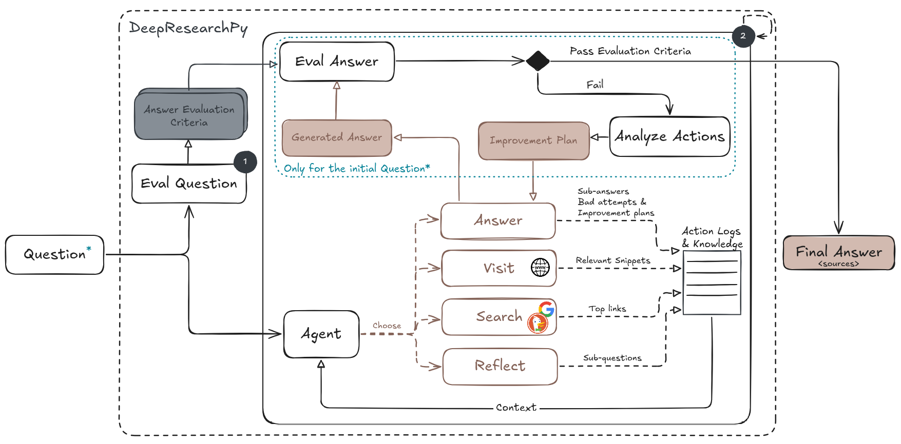
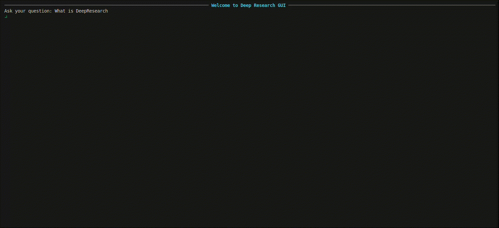

<p align="center">
    
</p>

**DeepResearchPy** is a Python package for automated deep query investigation. Modified from [JinaAI's `node-deepsearch`](https://github.com/jina-ai/node-DeepResearch/tree/main), it continuously **searches, reads, and reasons** across the web until it either finds a satisfying answer or exhausts a given token budget.

This tool is designed for scenarios where a simple search isn't enough. It mimics the behavior of a persistent human researcher: iteratively refining its understanding, evaluating new evidence, and adjusting strategy in real time.

> **Note:** This tool is not optimized for production use. It is intended for experimentation, prototyping, or research purposes.

## Key Features

* 🔍 **Iterative Search** – Refines queries based on partial information
* 🌐 **Web Reading** – Extracts relevant info from webpages
* 🧠 **Reasoning Loop** – Connects facts to form a coherent answer
* 🧯 **Token-Aware** – Stops when the computational budget is exhausted
* 🧪 **Useful for**: fact-finding, complex QA, ...

# Overview
<p align="center">
  
</p>

The diagram above outlines the looped reasoning and information retrieval process used in this project. The process begins with a **question evaluator LLM** that analyzes the user's question to determine which **answer evaluation criteria** apply, selecting from:

- **Freshness** – whether the question requires time-sensitive information  
- **Plurality** – whether multiple elements (e.g., examples) are expected  
- **Completeness** – whether the question targets multiple aspects or named entities  

### Agent Actions

After evaluation, a main **agent** chooses the next action based on the current context:

- **Reflect** – Identify knowledge gaps and generate sub-questions  
- **Search** – Search the web for relevant results. Semantically similar questions are deduplicated and rewritten before querying  
- **Visit** – Visit selected links and extract relevant snippets based on their semantic similarity to the input question.
Similarity scoring is performed using [`intfloat/multilingual-e5-small`](https://huggingface.co/intfloat/multilingual-e5-small), running inference on CPU, which may result in longer computation times

- **Answer** – Generate an answer using the gathered knowledge and current context  

### Answer Evaluation Loop

Once an answer is produced, it is evaluated by an **answer evaluator LLM** using the predefined criteria:

- If the answer is for the original user question and passes all criteria, it is returned as the **final answer**.
- If any criteria are not met, the failed attempt is logged along with an improvement plan proposed by an **action analysis LLM**. This model evaluates the previous actions that led to the erroneous answer and offers guidance on how to improve the plan. The process repeats until the answer meets all criteria or the **maximum number of attempts** is reached, at which point the best possible final answer is generated.


### Action Logs and Fallback

Each action is logged to build a history of:

- Gathered knowledge  
- Past decisions and outcomes
- Mistakes to avoid repeating  

If the **token budget** is nearly exceeded at any step, the system exits early and generates a final answer using the context available at that point with the last available budget.

> 💡 The full prompts can be found in the folder [`src/prompts`](src/prompts)


# Installation
1. Install [uv](https://astral.sh/blog/uv) if not already installed:
```bash
make uv
```
2. Set up the package and install dependencies:
```bash
make install
```

# Usage
1. Export your LLM provider API Key
```bash
export MISTRAL_API_KEY=...
# and/or
export OPENAI_API_KEY=...
```

2. Configure your agent (`research_config.yaml`)
```yaml
model_provider: "mistral"        # openai or mistral
model_name: "mistral-medium-2505"
max_token_budget: 100_000
top_k_urls_rerank: 10            # Max URLs to include in the context for the current question

# Steps config
reflect_step:
  max_decomposition_questions: 3 # Max sub-questions to generate in a reflect step
search_step:
  max_questions_to_search: 3     # Max sub-questions to search in a single search step
  top_k_search_results: 5
visit_step:
  max_urls_to_visit: 5           # Max URLs to read in a single visit step
answer_step:
  max_bad_attempts: 2


semantic_similarity:
  batch_size: 32
  max_length: 512

# Configuration for extracting relevant text snippets from a document based on a given question.
# Snippets are preferred over full documents due to context length limits in language models.
# A snippet is formed by combining consecutive document chunks.
# Chunking breaks the document into smaller parts to make semantic similarity scoring more efficient.
snippet_extraction:
  chunk_size: 400        # Number of characters in each document chunk
  snippet_length: 800    # Number of characters in each snippet
  num_snippets: 3        # Maximum number of top-ranked snippets to return per document
  min_similarity: 0.3    # Minimum semantic similarity threshold for a snippet to be considered relevant

```

3. Launch the Terminal GUI
```bash
uv run run.py
```

4. Ask your question and wait for your answer (It might take a while ☕)

<p align="center">
  
</p>


# Contacts

- Lila Boualili - [LinkedIn](https://www.linkedin.com/in/lilaboualili) - boualili18lila@gmail.com
- Aghiles Azzoug - [LinkedIn](https://www.linkedin.com/in/aghiles-azzoug/) - aghiles.ahmed.azzoug@gmail.com